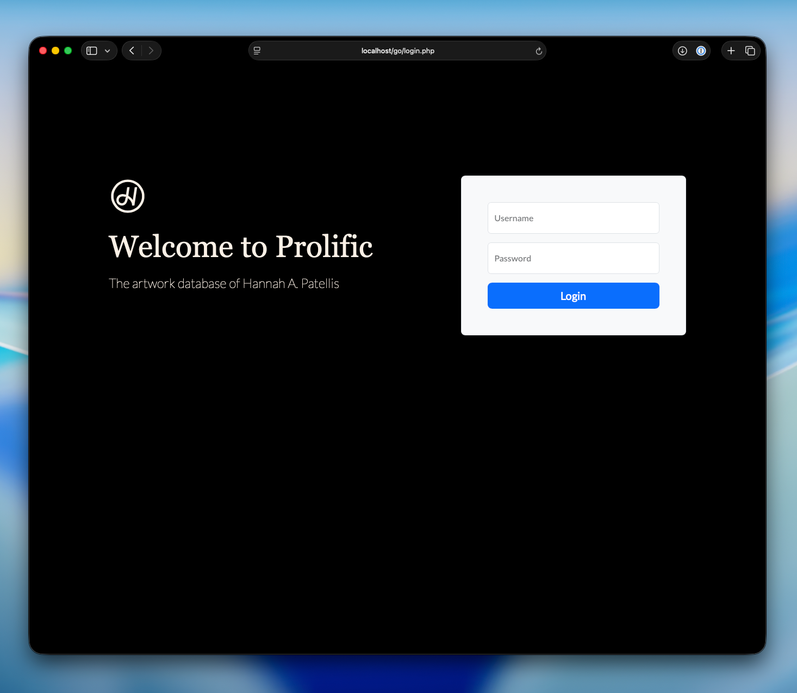

# Prolific

Art management software by Hannah A. Patellis

The goal behind Prolific was to be able to view all my works in one place and keep an up-to-date SQL database that would be easy to work with in future projects.

## Upcoming features

- Ability to replace an image without deleting the piece entry and re-adding it
- Ability to add guest users and select which pieces they can view
- Better error handling

## Databases

- Prolific currently is designed to use a single MySQL database with four tables:
  - `pieces` where each row is an individual work of art
  - `registry` where each row is a "registry entry" for upcoming features like the guest gallery
  - `users` where each row is a username/password for logging into PROlific
  - `cfa` where each row is a singular piece of physical certified fine art

Schemas for these tables are located in the `schemas` directory.

## Plugins Used

- [SimpleMDE - Markdown Editor (JS)](https://github.com/sparksuite/simplemde-markdown-editor)
  - Used for better input and viewing of notes, descriptions, and stories associated with each piece
- [Grid.js (JS)](https://github.com/grid-js/gridjs)
  - Used for dynamically building a table view of the gallery in JS, as well as for searching in the table view of the gallery

## Packages Used

- [Propel ORM v.2 (PHP)](https://propelorm.org)
  - MySQL database ORM

## env.json

A `env.json` file is expected in the `app` directory. The `env.json` file follows this template:

```
{
  "environment": "dev or prod",
  "hostname": "",
  "sql_cert": "/absolute/path/to/.crt",
  "sql_uri": "",
  "sql_port": "",
  "sql_user": "",
  "sql_password": "",
  "sql_db": "",
  "img_store_url": "A URL for the location of images (used in an  tag), either a relative path to the directory or an https:// location",
  "img_store_path": "Local path for the location of uploaded images"
}
```

Notes:
- The `img_store_path` is where images uploaded will be placed. The filename is the only thing kept in the SQL database
- The `sql_cert` may not be applicable to your MySQL setup and could be removed, although the `public/resource/db.php` file will need to be edited
- Currently `hostname` and `environment` aren't really being used for anything

## Screenshots from January 2026

More screenshots, including historical screenshots, can be found in the `docs` directory




---

Developed by Alexandria 'Hannah' I. Patellis, starting in 2024

[hannahap.com](https://hannahap.com)